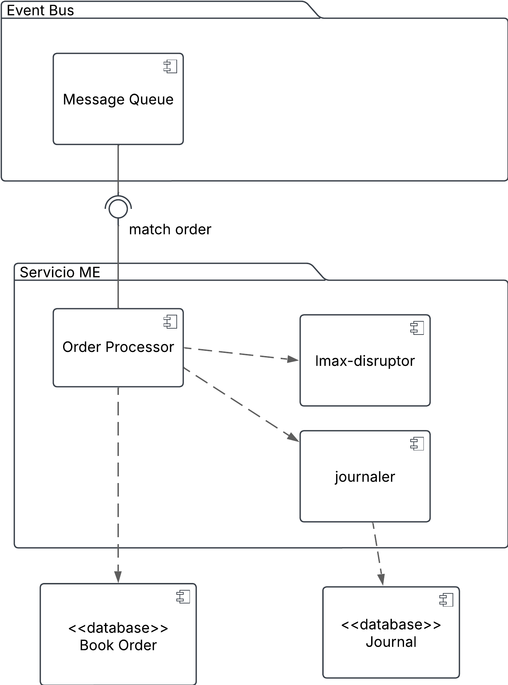
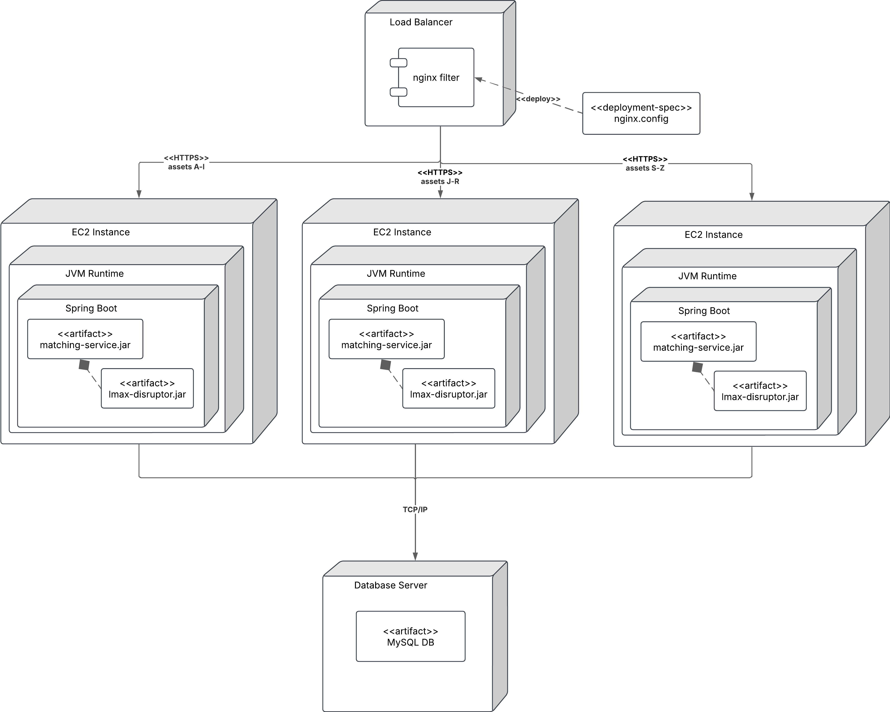
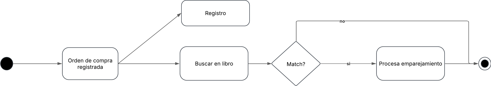
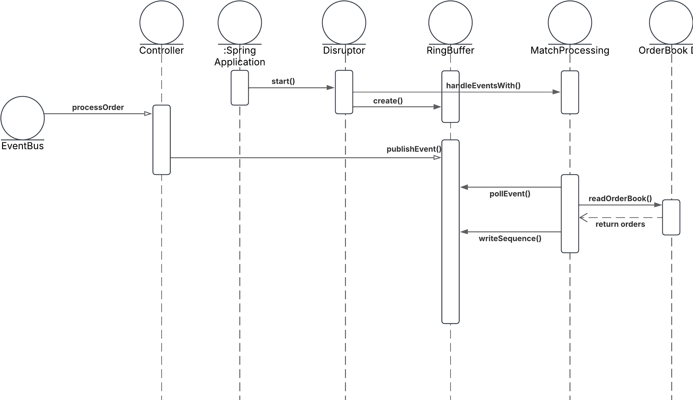

# lmax-experiment
Experimento de arquitectura usando LMAX - Curso Arquitectura Software UniAndes.

Se busca validar dos ASR:
- Latencia - 200ms
- Escalabilidad - 6500 tx/min durante 30 min

El escenario seleccionado es el proceso de emparejamiento de una orden de compra con una orden de venta. Se busca validar la capacidad de procesamiento de la arquitectura LMAX para el procesamiento de estas transacciones.

Para acceder al servicio con la implementación realizada se ofrece el siguiente endpoint

`microservicio-alb-625073029.us-east-1.elb.amazonaws.com`

# Arquitectura
## Vista de componentes

## Vista de Despliegue

## Vistas de concurrencia
### Vista de actividades

### Vista de secuencia

